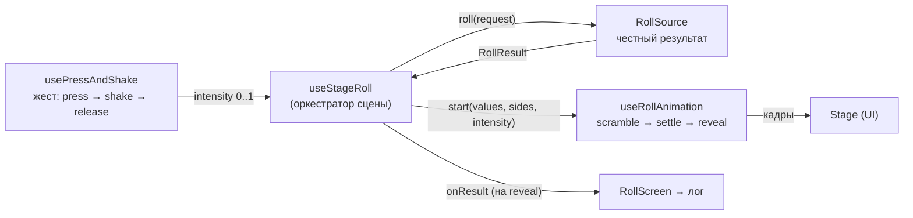
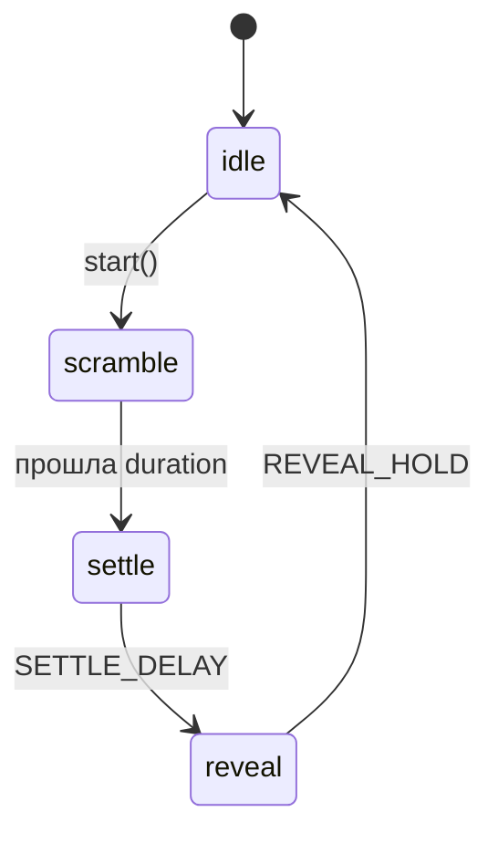

# Анимация и жест броска

> Эмоциональное ядро приложения: как тап/тряска превращаются в эффектный бросок и
> почему анимация **никогда** не влияет на результат.

## TL;DR

Бросок — это связка трёх независимых частей, которые оркеструет один хук:

**Ключевой принцип:** результат фиксируется честным `RollSource` в момент отпускания
жеста, ещё ДО анимации. Анимация лишь «проявляет» уже известные значения —
интенсивность тряски меняет только её длительность и динамику, но не числа.

## Жест: usePressAndShake

Файл: [usePressAndShake.ts](../src/shared/lib/usePressAndShake.ts).

- `pointerdown` → `beginPress()`: запоминаем время старта, поднимаем `isPressing`,
  через `requestAnimationFrame` копим растущую `intensity` (для визуала тряски).
- `pointerup` → `endPress(true)`: считаем финальную интенсивность и вызываем
  `onRelease(intensity)`.
- `pointercancel` → `endPress(false)`: прерывание без броска.
- Клавиатура (`Space`/`Enter`) → бросок с минимальной интенсивностью (тап).

Маппинг интенсивности:

| Константа | Значение | Смысл |
| --------- | -------- | ----- |
| `MAX_PRESS_MS` | 1500 | За сколько мс удержания intensity достигает 1.0 |
| `TAP_INTENSITY` | 0.12 | Интенсивность короткого тапа/клавиатуры |

`intensity = clamp01((now - startTime) / MAX_PRESS_MS)`. При отпускании берётся
`max(intensity, TAP_INTENSITY)` — чтобы даже мгновенный тап дал заметную анимацию.

`setPointerCapture` гарантирует получение `pointerup`, даже если палец/курсор ушёл
за пределы сцены.

## Анимация: useRollAnimation

Файл: [useRollAnimation.ts](../src/shared/lib/useRollAnimation.ts). Машина состояний
на `requestAnimationFrame`:

- **scramble** — быстрая смена кадров: на каждом «свопе» каждому кубику даётся
  случайная вариация силуэта (`frameIndex`) и случайное мелькающее число. Интервал
  между свопами растёт от `START_INTERVAL` к `END_INTERVAL` по `easeOut(progress)` —
  отсюда ощущение «быстро в начале, замедляется к концу».
- **settle** — мгновенный снэп к финальным значениям из `RollResult`.
- **reveal** — короткая пауза показа результата (для «пульса» и крита), затем `idle`.

Тайминги:

| Константа | Значение | Смысл |
| --------- | -------- | ----- |
| `BASE_DURATION` | 600 мс | Базовая длительность scramble |
| `MAX_EXTRA_DURATION` | 1600 мс | Добавка при максимальной интенсивности |
| `START_INTERVAL` | 45 мс | Интервал смены кадров в начале (быстро) |
| `END_INTERVAL` | 175 мс | Интервал в конце (медленно) |
| `SETTLE_DELAY` | 120 мс | Пауза перед reveal |
| `REVEAL_HOLD` | 700 мс | Сколько держим reveal |

`duration = BASE_DURATION + intensity * MAX_EXTRA_DURATION` — вот как «дольше/сильнее
тряс» превращается в более долгую анимацию.

### Надпись под сценой (readout)

Текст под кубиками отражает текущий момент броска и подаёт «эмоцию» героя:

| Состояние | Что показываем |
| --------- | -------------- |
| Покой, результата ещё нет | подсказка «Нажми кубик…» |
| `isPressing` (зажали и трясём) | случайная **shake**-реплика класса |
| `isRolling` (`scramble`/`settle`, кубики крутятся) | случайная **release**-реплика класса |
| Есть результат и жест/анимация завершены | `Результат: N` (+ разбивка для нескольких кубиков/модификатора) |

Условие тотала — `lastResult != null && !isRolling && !isPressing`: при повторной
тряске поверх показанного результата надпись сразу сменяется на реплику тряски, а не
держит старое число. Сами фразы по классам и принцип их выбора — в
[character.md](./character.md).

## Оркестрация: useStageRoll

Файл: [useStageRoll.ts](../src/features/stage/model/useStageRoll.ts).

1. `handleRelease(intensity)` → `await rollSource.roll(request)` → честный `RollResult`
   складывается в `pendingRef`, затем `start({ values, sides, intensity })`.
2. На фазе `reveal` (через `useEffect`) результат публикуется **ровно один раз** через
   `onResult` (→ лог) и сохраняется в `lastResult` (→ тотал/крит на сцене).
3. Жест блокируется (`disabled`), пока идёт `scramble`/`settle` — нельзя начать новый
   бросок поверх текущего.

### Сброс при смене параметров

При изменении сигнатуры `die|count|modifier|mode` состояние анимации и `lastResult`
сбрасываются — иначе на сцене остались бы «чужие» значения (например, 14 от d20 на
d6) и старое количество кубиков. Реализовано **корректировкой состояния во время
рендера** (сравнение сигнатуры, без `useEffect`), чтобы не плодить каскадные
ре-рендеры — это рекомендованный React-паттерн.

### Пул преимущества/помехи: интрига и подсветка

Для d20 в режиме adv/dis бросок — это **пул** костей, из которого учитывается одна
(см. [rolling-domain.md](./rolling-domain.md)). На сцене анимируется **весь пул**, и
есть две тонкости ради сохранения «магии броска»:

- **Перемешивание порядка.** `useStageRoll` тасует пул (Фишер–Йейтс) перед
  анимацией и отдаёт `droppedFlags` (маска проигравших по позиции). Иначе победитель
  всегда оказывался бы слева и выдавал исход заранее. Это **чисто презентационное**
  перемешивание (через `Math.random`) — на честный результат не влияет.
- **Затенение только после расчёта.** Проигравшие кости приглушаются (`.droppedDie`:
  opacity + grayscale + scale) начиная с фазы `reveal` и **остаются** затенёнными в
  `idle`, но НЕ во время `scramble`/`settle` — пока «идёт расчёт», все кубики
  равноправны. Крит-подсветка (natural 20/1) у отброшенной кости подавляется, чтобы
  проигравший бросок не вспыхивал цветом крита.

## Доступность

- `useReducedMotion()` ([useReducedMotion.ts](../src/shared/lib/useReducedMotion.ts))
  следит за `prefers-color-scheme`-аналогом `prefers-reduced-motion`.
- В настройках есть явный тумблер «отключить анимации».
- Любой из них → `reducedMotion: true` → анимация пропускает scramble и сразу
  показывает результат (`reveal`), удерживая `REVEAL_HOLD`.

## Почему так

- **Честность результата** важна для будущего мультиплеера/доверия: значения не
  зависят от того, как именно крутилась анимация.
- **rAF, а не CSS-таймеры** — чтобы плавно менять интервал кадров (ease-out) и легко
  прерывать/сбрасывать.
- **Разделение жест/анимация/источник** — каждую часть можно тестировать и заменять
  отдельно (например, `RemoteRollSource` вместо локального — см.
  [rolling-domain.md](./rolling-domain.md)).
