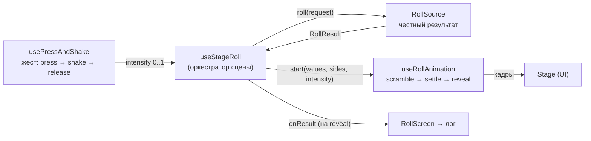
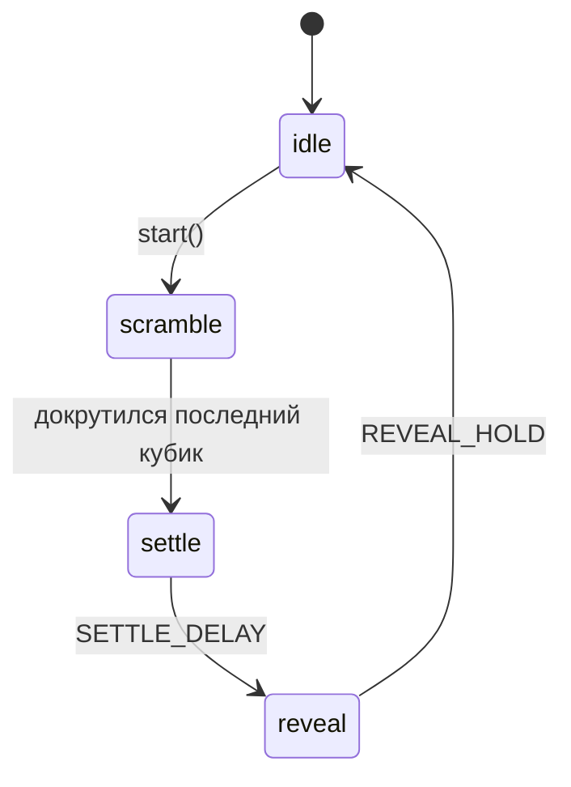

# Анимация и жест броска

> Эмоциональное ядро приложения: как тап/тряска превращаются в эффектный бросок и
> почему анимация **никогда** не влияет на результат.

## TL;DR

Бросок — это связка трёх независимых частей, которые оркеструет один хук:

**Ключевой принцип:** результат фиксируется честным `RollSource` в момент отпускания
жеста, ещё ДО анимации. Анимация лишь «проявляет» уже известные значения —
интенсивность тряски меняет только её длительность и динамику, но не числа.

## Жест: usePressAndShake

Файл: [usePressAndShake.ts](../src/shared/lib/usePressAndShake.ts).

- `pointerdown` → `beginPress()`: запоминаем время старта, поднимаем `isPressing`,
  через `requestAnimationFrame` копим растущую `intensity` (для визуала тряски).
- `pointerup` → `endPress(true)`: считаем финальную интенсивность и вызываем
  `onRelease(intensity)`.
- `pointercancel` → `endPress(false)`: прерывание без броска.
- Клавиатура (`Space`/`Enter`) → бросок с минимальной интенсивностью (тап).

Маппинг интенсивности:

| Константа | Значение | Смысл |
| --------- | -------- | ----- |
| `MAX_PRESS_MS` | 3000 | За сколько мс удержания intensity достигает 1.0 |
| `TAP_INTENSITY` | 0.12 | Интенсивность короткого тапа/клавиатуры |

`intensity = clamp01((now - startTime) / MAX_PRESS_MS)`. При отпускании берётся
`max(intensity, TAP_INTENSITY)` — чтобы даже мгновенный тап дал заметную анимацию.

`setPointerCapture` гарантирует получение `pointerup`, даже если палец/курсор ушёл
за пределы сцены.

## Тиры зажатия: normal → charged → epic

Непрерывная `intensity` — это «сырая» сила зажатия. Поверх неё есть **дискретные
тиры** — чистая функция [getPressTier(intensity)](../src/shared/lib/pressTier.ts)
(без React/DOM, покрыта юнит-тестом):

| Тир | Порог intensity | Смысл |
| --- | --------------- | ----- |
| `normal` | `< 1/3` | обычный тап/короткое зажатие |
| `charged` | `≥ 1/3` (`CHARGED_PRESS_INTENSITY`) | заметно «заряженный» бросок (≈1 c удержания) |
| `epic` | `≥ 1.0` (`EPIC_PRESS_INTENSITY`) | особо сильное зажатие (≈3 c, до максимума): максимум драмы |

Пороги заданы в долях intensity, а при `MAX_PRESS_MS = 3000` это **1 c** (charged)
и **3 c** (epic) удержания — переход 2→3 фазы (2 c) вдвое длиннее перехода 1→2
(1 c).

**Как тиры подаются визуально** (важная асимметрия):

- переход **normal → charged плавный** — обе фазы живут на одном непрерывном
  континууме `--shake` (свечение/яркость/амплитуда тряски растут без скачка, как
  было исходно). Отдельного CSS-класса у `charged` нет: тир `charged` нужен для
  логики/фраз, но не «щёлкает» по виду;
- **epic — единственная дискретная фаза**: при пересечении порога вешается CSS-класс
  `.epic`, и свечение скачком «пробивается» (второй широкий ореол + резкий рост
  яркости и амплитуды). Так особо важный бросок ощущается как новый режим, а не как
  «ещё чуть ярче».

Функция используется в двух местах:

- **живой визуал** — `Stage` считает `getPressTier(intensity)` каждый кадр. Свечение
  и тряска нарастают непрерывно от `--shake` (это и есть плавный normal→charged), а
  при тире `epic` дополнительно вешается класс `.epic` (дискретный «пробой»: второй
  широкий ореол, резкий рост яркости и множителя амплитуды `--shake-amp`);
- **бросок** — `useStageRoll` считает тир по интенсивности **отпускания** и передаёт
  флаг `epic` в анимацию.

Эпик уважает доступность: под `reducedMotion` класс `.epic` не вешается (усиленной
тряски нет), а анимация и так пропускает scramble.

> _TODO (задел под «шаг 2»):_ отдельная группа **эпик-реплик** по классам — тир уже
> доступен в `Stage`, осталось добавить набор фраз (`phrases`) и показывать их на
> эпическом броске. Возможные расширения: всполох аур на входе в эпик,
> `navigator.vibrate` на мобиле, «звук зарядки» через `shared/services/audio`.

## Анимация: useRollAnimation

Файл: [useRollAnimation.ts](../src/shared/lib/useRollAnimation.ts). Машина состояний
на `requestAnimationFrame`:

- **scramble** — перебор кадров с псевдо-вращением силуэта. Силуэт непрерывно
  «кувыркается» (3D-`rotateY`), а смена номинала привязана не к таймеру, а к самому
  **вращению**: новое число выдаётся на каждом «ребре» оборота (см. ниже про
  `spinReveal.ts`). Поэтому цифры всегда «поспевают» за кубиком — быстро крутится —
  частят, замедляется — меняются степенно. У КАЖДОГО кубика своя длительность,
  своё направление (±) и своё число оборотов — поэтому они «приземляются»
  вразнобой (см. ниже про покубичную интерполяцию). Вариации силуэта перебираются
  ДЕТЕРМИНИРОВАННО по кругу (`(swapCount + i) % framesPerDie`), а не случайно: иначе
  подряд выпадал тот же силуэт и перебор не читался как вращение; смещение `+i`
  рассинхронизирует кубики между собой.
- **settle** — мгновенный снэп к финальным значениям из `RollResult` (число уже
  «приземлено» на последнем обороте, см. ниже — поэтому снэп незаметен).
- **reveal** — короткая пауза показа результата (для «пульса» и крита), затем `idle`.

Тайминги:

| Константа | Значение | Смысл |
| --------- | -------- | ----- |
| `BASE_DURATION` | 600 мс | Базовая длительность scramble |
| `MAX_EXTRA_DURATION` | 1600 мс | Добавка при максимальной интенсивности |
| `SETTLE_DELAY` | 120 мс | Пауза перед reveal |
| `REVEAL_HOLD` | 700 мс | Сколько держим reveal |
| `EPIC_EXTRA_DURATION` | 3200 мс | Добавка к scramble на эпическом броске |
| `SPIN_DURATION_SPREAD` | 1800 мс | Разброс длительности МЕЖДУ кубиками (случайная добавка 0..spread) |
| `MS_PER_TURN` | 220 мс | На один оборот при выборе числа оборотов (≈ старт-скорости) |
| `MIN_TURNS` | 3 | Минимум оборотов даже у самого короткого броска |
| `SPIN_COMPLETE` | 0.997 | Доля поворота, после которой остаток считаем «докрученным» (срез хвоста) |
| `SPIN_SWAP_PERIOD` | 180° | Период смены номинала = один видимый оборот |
| `SPIN_SWAP_PHASE` | 90° | Сдвиг смены на «ребро» (90°/270°), где цифра почти не видна |

`baseDuration = BASE_DURATION + intensity * MAX_EXTRA_DURATION` — вот как
«дольше/сильнее тряс» превращается в более долгую анимацию. Для **эпического**
броска добавляется `EPIC_EXTRA_DURATION` (дольше вращение) и берётся более крутая
кривая замедления — пятой степени `easeOutEpic` вместо квадратичной `easeOut`.
Крутая кривая даёт резкую смену темпа: почти всё время кубик крутится бешено, затем
величаво срывается в долгий тягучий докрут — «затаённое дыхание» перед результатом.

**Покубичная интерполяция угла.** Вместо одного общего угла на всю группу у каждого
кубика `i` свой угол `θ_i(t) = total_i · ease(t / d_i)`:
- _Длительность._ `d_i = baseDuration + random(0..SPIN_DURATION_SPREAD)` — базу все
  получают одинаковую, а сверху случайную добавку, поэтому кубики финишируют
  вразнобой («приземление по одному» добавляет драмы).
- _Число оборотов._ `total_i = max(MIN_TURNS, round(d_i / MS_PER_TURN)) · 360°` —
  кратно полному обороту, так что к финишу кубик приходит «лицом» (не зеркально), и
  его не нужно дёргать в вертикаль. Обороты ∝ длительности, поэтому стартовая
  скорость у всех примерно одинакова — отличается именно ВРЕМЯ докрута.
- _Направление._ `dir_i = ±1` случайно; знак применяется ТОЛЬКО в CSS-трансформе
  (`rotateY(dir·θ)`), а в `spinRevealIndex` идёт модуль угла — последовательность
  чисел не зависит от направления.

[`Stage`](../src/features/stage/ui/Stage.tsx) прокидывает на КАЖДЫЙ
[`Die`](../src/entities/die/ui/Die.tsx) свои CSS-переменные `--die-rot` (= `dir·θ_i`)
/ `--die-rot-ms` (= `dt · SPIN_MS_SLACK`) через `style`, а `Die` на фазе scramble
крутит силуэт и цифру `transform: rotateY(var(--die-rot))` с
`transition var(--die-rot-ms) linear`. Длительность перехода чуть больше кадра,
поэтому он никогда не «доезжает» досрочно и докрут непрерывен — без «стоп-кадров».

**Срез невидимого хвоста.** `ease` асимптотически подползает к `total`, и последние
доли процента угла глазом не видны — кубик кажется стоящим, но раньше группа всё
равно ждала полного `d_i` (особенно заметная «мёртвая пауза» у эпика с хвостом 5-й
степени). Теперь каждый кубик фиксируем (settled, финал «лицом») на
`spinEnd_i = d_i · completeFraction`, где `completeFraction` — момент, когда `ease`
достигает `SPIN_COMPLETE` (обратная функция ease: для эпика ≈ 0.69, т.е. срезаем
~31% хвоста). Переход к `settle` срабатывает по самому позднему `spinEnd`, а не по
полному `duration` — пауза в конце исчезает.

**Смена номинала на ребре ([`spinReveal.ts`](../src/shared/lib/spinReveal.ts)).**
Цифра крутится 1:1 с силуэтом, «изнанку» НЕ прячем — зеркаленье на задней
половине просто читается как часть вращения. Меняем только САМО значение, и в
нужный момент:
- _Видимый оборот = 180°._ Силуэты симметричны, и под `rotateY` форма на 180°
  выглядит как завершённый оборот. Поэтому период смены `SPIN_SWAP_PERIOD = 180°`:
  одно число на один видимый оборот. При 360° число «висело» бы два оборота.
- _Меняем на ребре._ На «ребре» (θ ≈ 90°/270°, `SPIN_SWAP_PHASE = 90°`) грань
  перпендикулярна зрителю (cosθ ≈ 0, ширина → 0), цифра почти не видна —
  новое число «вырастает из ребра». `spinRevealIndex = floor((spin+90)/180)`.
- _Экранный угол._ Целевой `θ_i` отстаёт от экрана из-за `transition` +
  `SPIN_MS_SLACK`, поэтому момент смены считаем по `shown = θ_i − slack·step`.
- _Без пропусков._ Шаг угла за кадр (`< 180°` на всех скоростях) не даёт одному
  кадру «перепрыгнуть» смену — ровно одна смена на каждом ребре даже на эпике.

**Приземление финала заранее.** На scramble числа случайные, а итог раньше
появлялся только в `settle` — отсюда резкая подмена в последнюю миллисекунду.
Теперь на каждом свопе кубика смотрим оставшийся угол `total_i − shown`. Как только
он ≤ `SPIN_SWAP_PERIOD` (начался последний видимый оборот, свопов больше не будет) —
ставим `landed_i` и показываем уже ФИНАЛЬНОЕ значение: силуэт докручивается, а число
уже задуманное. Тогда `settle` ничего не меняет — скачка в конце нет.
RNG честный: итог берётся из `values`, мы лишь показываем его на оборот раньше.
Покубичная случайность (направление/срок вращения) — тоже сугубо ВИЗУАЛЬНАЯ
(`Math.random()`), на результат броска не влияет.

### Надпись под сценой (readout)

Текст под кубиками отражает текущий момент броска и подаёт «эмоцию» героя:

| Состояние | Что показываем |
| --------- | -------------- |
| Покой, результата ещё нет | подсказка «Нажми кубик…» |
| `isPressing` (зажали и трясём) | случайная **shake**-реплика класса |
| `isRolling` (`scramble`/`settle`, кубики крутятся) | случайная **release**-реплика класса |
| Есть результат и жест/анимация завершены | `Результат: N` (+ разбивка для нескольких кубиков/модификатора) |

Условие тотала — `lastResult != null && !isRolling && !isPressing`: при повторной
тряске поверх показанного результата надпись сразу сменяется на реплику тряски, а не
держит старое число. Сами фразы по классам и принцип их выбора — в
[character.md](./character.md).

## Оркестрация: useStageRoll

Файл: [useStageRoll.ts](../src/features/stage/model/useStageRoll.ts).

1. `handleRelease(intensity)` → `await rollSource.roll(request)` → честный `RollResult`
   складывается в `pendingRef`, затем `start({ values, sides, intensity })`.
2. На фазе `reveal` (через `useEffect`) результат публикуется **ровно один раз** через
   `onResult` (→ лог) и сохраняется в `lastResult` (→ тотал/крит на сцене).
3. Жест блокируется (`disabled`), пока идёт `scramble`/`settle` — нельзя начать новый
   бросок поверх текущего.

### Сброс при смене параметров

При изменении сигнатуры `die|count|modifier|mode` состояние анимации и `lastResult`
сбрасываются — иначе на сцене остались бы «чужие» значения (например, 14 от d20 на
d6) и старое количество кубиков. Реализовано **корректировкой состояния во время
рендера** (сравнение сигнатуры, без `useEffect`), чтобы не плодить каскадные
ре-рендеры — это рекомендованный React-паттерн.

### Пул преимущества/помехи: интрига и подсветка

Для d20 в режиме adv/dis бросок — это **пул** костей, из которого учитывается одна
(см. [rolling-domain.md](./rolling-domain.md)). На сцене анимируется **весь пул**, и
есть две тонкости ради сохранения «магии броска»:

- **Перемешивание порядка.** `useStageRoll` тасует пул (Фишер–Йейтс) перед
  анимацией и отдаёт `droppedFlags` (маска проигравших по позиции). Иначе победитель
  всегда оказывался бы слева и выдавал исход заранее. Это **чисто презентационное**
  перемешивание (через `Math.random`) — на честный результат не влияет.
- **Затенение только после расчёта.** Проигравшие кости приглушаются (`.droppedDie`:
  opacity + grayscale + scale) начиная с фазы `reveal` и **остаются** затенёнными в
  `idle`, но НЕ во время `scramble`/`settle` — пока «идёт расчёт», все кубики
  равноправны. Крит-подсветка (natural 20/1) у отброшенной кости подавляется, чтобы
  проигравший бросок не вспыхивал цветом крита.

## Доступность

- `useReducedMotion()` ([useReducedMotion.ts](../src/shared/lib/useReducedMotion.ts))
  следит за `prefers-color-scheme`-аналогом `prefers-reduced-motion`.
- В настройках есть явный тумблер «отключить анимации».
- Любой из них → `reducedMotion: true` → анимация пропускает scramble и сразу
  показывает результат (`reveal`), удерживая `REVEAL_HOLD`.

## Почему так

- **Честность результата** важна для будущего мультиплеера/доверия: значения не
  зависят от того, как именно крутилась анимация.
- **rAF, а не CSS-таймеры** — чтобы плавно менять интервал кадров (ease-out) и легко
  прерывать/сбрасывать.
- **Разделение жест/анимация/источник** — каждую часть можно тестировать и заменять
  отдельно (например, `RemoteRollSource` вместо локального — см.
  [rolling-domain.md](./rolling-domain.md)).

## Компоновка сцены: рост вверх при неизменном низе

Число кубиков на сцене меняется (1 у обычного d20, 2 при преимуществе/помехе, 3 при
«эльфийской меткости», а на узком экране они переносятся в две строки). Если бы
карточка сцены просто росла **вниз** от добавления кубиков, всё под ней (лента выбора
номинала, контролы, барабан режима) дёргалось бы вниз прямо во время выбора режима.

**Решение — резерв + рост вверх** ([Stage.tsx](../src/features/stage/ui/Stage.tsx),
[Stage.module.css](../src/features/stage/ui/Stage.module.css)):

- Обёртка `.trayReserve` держит **в потоке** высоту самого «высокого» расклада
  (`min-height: 16.5rem` ≈ 264px = 2 строки кубиков d20 + зазор + падинги, с запасом).
  Именно она резервирует место, поэтому всё, что ниже сцены, стоит на месте.
- Сама карточка `.tray` — `position: absolute`, прижата к **низу** резерва
  (`bottom: 0`) и по высоте равна своему содержимому (базовая `min-height: 11.25rem`
  ≈ 180px, как одна строка). Растёт **вверх** в зарезервированное место.

Итог: низ карточки и все контролы неподвижны при смене числа кубиков; короткая
карточка (1 кубик) просто опущена вниз — свободное место над ней прозрачное (это
опущенная сцена, а не пустота внутри карточки); на мобильном сцена ещё и ближе к
большому пальцу. `position: absolute` у `.tray` заодно остаётся containing block для
её декоративных аур-псевдоэлементов (`::before/::after`).

> Геометрический инвариант («низ резерва постоянен, карточка растёт вверх») проверяется
> вживую в браузере; в jsdom высоты — нули.

## Тач-нюанс: «залипающий» `:hover` (sticky hover)

На устройствах без настоящего наведения (телефон, планшет, **DevTools-эмуляция
тача**) браузер после тапа оставляет псевдокласс `:hover` активным на элементе —
он держится, пока не тапнешь в другое место. Это поведение спецификации, не баг.

Для **косметических** подсветок (фон/цвет кнопки) это безвредно: чуть подсвеченный
фон до следующего тапа никого не смущает. Поэтому большинство `:hover` в проекте
(кнопки ui-kit, ячейки выбора класса, лента кубиков и т.п.) оставлены как есть.

Проблема возникает, когда `:hover` используется как **прокси для состояния
виджета** — тогда залипший hover выглядит как застрявший UI. Был ровно такой случай:
подпись «Режим» над барабаном выбора d20 ([RollControls](../src/features/roll-controls/ui/RollControls.module.css))
размывалась через `.mode:hover`, чтобы спрятаться под раскрытым барабаном. После
тач-выбора барабан закрывался (JS-состояние отрабатывало верно), но залипший
`:hover` держал подпись размытой.

**Правило:** не завязывай визуальное состояние на `:hover`/`:focus-within`, если
оно должно отражать **реальное состояние** интерактивного виджета. Вместо этого
выставляй состояние явно и реагируй на него:

- `WheelPicker` пишет своё `isOpen` в атрибут `data-open="true|false"` на корне
  ([WheelPicker.tsx](../src/shared/ui/WheelPicker.tsx));
- соседняя подпись реагирует на него через `:has()`:
  `.mode:has([data-open='true']) .modeLabel { filter: blur(4px) }`.

Так блюр включён ровно тогда, когда барабан реально раскрыт — одинаково для мыши,
тача и клавиатуры, и залипающий hover ни на что не влияет.

> **Проверка на тач без реального устройства.** В Playwright-сессии тач-события
> шлются через CDP (`Input.dispatchTouchEvent`), а медиа `(hover: none)` — через
> `Emulation.setEmulatedMedia`. Признак залипания — после тапа элемент всё ещё
> `el.matches(':hover') === true`. Корректный фикс делает визуальное состояние
> независимым от этого флага (см. выше).

## Device-aware взаимодействие барабана (`WheelPicker`)

Барабан раскрывается/выбирает по-разному в зависимости от типа указателя
(`event.pointerType`) — иначе тач-устройства ловят два бага:

1. **«Первый тап не открывает».** Раскрытие по наведению (`pointerenter`) — мышиная
   парадигма. На тач `pointerenter` приходит вместе с касанием, а `pointerleave` —
   сразу после отрыва пальца: барабан открывался и тут же закрывался, поэтому первый
   тап «не срабатывал», помогал только второй. **Фикс:** `onPointerEnter`/
   `onPointerLeave` раскрывают барабан **только** при `pointerType === 'mouse'`;
   тачем барабан раскрывается тапом (на `pointerup`).
2. **«Свайп листает сразу через два».** После свайпа браузер слал «хвостовой» click
   по пункту под отпущенным пальцем, и тот принудительно выбирал пункт **поверх**
   того, к чему уже прилип нативный scroll-snap, — выходило два шага. **Фикс:** на
   `pointerdown` запоминаем Y касания; если палец ушёл дальше `TAP_MOVE_THRESHOLD`
   (8px) — это **свайп**: выбор не делаем вовсе, отдавая жест нативному snap + дебаунс
   `handleScroll`. Тап (сдвиг ≤ порога) на раскрытом барабане выбирает пункт
   **геометрически** — по смещению `clientY` от центра / `ITEM_HEIGHT` (та же формула,
   что для мыши). Парный click по пункту глушится флагом (`touchHandledRef` для тача,
   `mouseHandledRef` для мыши), оставляя «голый» click лишь как доступный fallback
   (клавиатура/AT): он раскрывает свёрнутый барабан и выбирает пункт в раскрытом.

CSS-добавка: `.viewport { touch-action: pan-y }` — браузер быстрее «решает», что жест
вертикальный, и не съедает первые пиксели на распознавание прокрутки. Файл —
[WheelPicker.tsx](../src/shared/ui/WheelPicker.tsx).

Эти сценарии — чисто геометрические (координаты касания, scroll-snap), поэтому покрыты
**только e2e** ([e2e/wheel-picker.spec.ts](../e2e/wheel-picker.spec.ts), блок
«тач-жесты»: первый тап раскрывает, свайп листает ровно на один пункт, тап по пункту
ниже центра выбирает именно его). В Vitest проверяется лишь click-fallback.

## Системная «вспышка» при тапе (`-webkit-tap-highlight-color`)

На мобильных WebKit/Blink (Safari iOS, Chrome Android) браузер рисует поверх любого
интерактивного элемента (кнопка, `role="button"`, радио-пункты барабана, элементы с
`tabindex`) полупрозрачную голубовато-серую подсветку на момент касания. У нас отклик
на нажатие уже передают собственные стили (`:active`, тряска сцены, свечение), поэтому
системная вспышка только мешает. Глобально гасим её в
[global.css](../src/app/styles/global.css): `* { -webkit-tap-highlight-color: transparent }`.
Это **не** выделение текста (`::selection`) и **не** фокус-кольцо (`:focus-visible`) —
их не трогаем.
