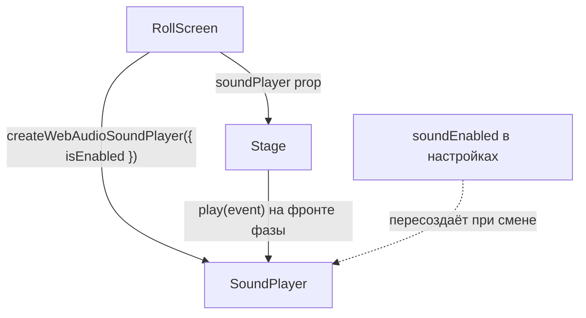

# Звук броска (audio)

Короткое процедурное озвучивание броска: без файлов-ассетов, всё синтезируется
на лету через **Web Audio API**. Стиль — оркестрово-«арфовый» в духе
JRPG 16-битной эпохи (Final Fantasy VI): мягкие треугольные/синусоидальные
тембры (арфа/колокольчик), пентатоника, лёгкая реверберация — вместо
«сэмплов».

> Связанные документы: [анимация и жест](./animation-and-gesture.md)
> (откуда берутся фазы-триггеры), [управление состоянием](./state-management.md)
> (тумблер `soundEnabled` в настройках).

## Зачем синтез, а не файлы

- Нет бинарных ассетов в репозитории — звук правится как **данные** (партитуры).
- Лёгкий вес и мгновенный старт.
- Учебная ценность: видно, как из осцилляторов собирается «тук» и «дзынь».

## Архитектура

Звук — это **сервис за интерфейсом** `SoundPlayer` (как `RollSource`), а не часть
домена. Домен броска остаётся чистым и беззвучным.

```
shared/services/audio.ts
  SoundEvent                 — идентификаторы событий
  SoundPlayer                — интерфейс { play(event) }
  noopSoundPlayer            — тихая заглушка (дефолт + тесты)
  createWebAudioSoundPlayer  — реальный проигрыватель (Web Audio)
```

Поток внедрения (DI), сверху вниз — как и у `RollSource`:



### Тумблер `soundEnabled`

Проигрыватель создаётся в `RollScreen` через `useMemo` с зависимостью от
`settings.soundEnabled` — при переключении тумблера он пересоздаётся (переключения
редки, по умолчанию звук **выключен**):

```ts
const soundPlayer = useMemo(
  () => createWebAudioSoundPlayer({ isEnabled: () => settings.soundEnabled }),
  [settings.soundEnabled],
)
```

`play()` на каждом вызове спрашивает `deps.isEnabled()` — при выключенном звуке
это no-op, и `AudioContext` **не создаётся вовсе**.

## Ленивый AudioContext и autoplay-политика

`AudioContext` создаётся **лениво на первом `play()`**. Первое событие —
`shakeStart` — возникает в ответ на жест пользователя (нажатие/зажатие), поэтому
браузерная autoplay-политика не блокирует звук. Если контекст «уснул» (смена
вкладки), `play()` будит его через `resume()`.

SSR-безопасно: `getAudioContextCtor()` возвращает `null`, если `window` или
`AudioContext`/`webkitAudioContext` недоступны, и `play()` тихо ничего не делает.

## События и триггеры

Два рода звуков: **одноразовые** (`SoundEvent`, метод `play`) и **непрерывные**
(`LoopEvent`, метод `loop`). Одноразовые привязаны к фазам/тирам (фронт
перехода ловим паттерном «корректировки состояния во время рендера»
в `Stage`), непрерывные — через `useEffect` (нужна очистка start/stop).

### Одноразовые (`play`)

| Событие       | Когда                                   | Звук                                       |
| ------------- | --------------------------------------- | ------------------------------------------ |
| `shakeStart`  | начало зажатия (тряска)                 | восходящий арфовый «грейс-нот» (A3→E4 + искра) |
| `charged`     | переход в тир `charged` (≈1 c удержания) | короткий «набор силы» вверх (E4→B4)        |
| `epic`        | переход в тир `epic` (≈3 c удержания)    | «всплеск силы»: бас-удар + трезвучие вверх |
| `settle`      | вход в фазу `settle` (приземление)      | «тук» арфы со спадом + квинта              |
| `reveal`      | вход в `reveal`, обычный результат    | арфовое глиссандо по пентатонике + колокол |
| `critSuccess` | вход в `reveal`, натуральная 20 на d20  | «Victory Fanfare» FF6: трель C5 → A♭4-B♭4 → C-мажор + колокол |
| `critFail`    | вход в `reveal`, натуральная 1 на d20   | арфовый спуск в a-moll (E5→C5→A4) в гулкую низкую квинту |

Тиры зажатия (`getPressTier`) эскалируют `normal → charged → epic`; звуки
`charged`/`epic` срабатывают только «вверх» (intensity растёт лишь пока
держим). Они не завязаны на reduced-motion (берём `getPressTier(intensity)`,
а не визуальный `isEpic`).

Криты намеренно «прорастают» из арфового каскада вращения (`spin`): тот же
тёплый тембр (triangle + sine-колокол + реверб), а не удар встык. Пара
тематична — успех в **C-мажоре** (мотив Победы Уэмацу сохранён), провал в
относительном **a-moll**.

Крит определяется по **видимой** кости (`displayCrit`), синхронно с руной-печатью
под кубиком. На входе в `reveal` играет либо крит, либо обычный `reveal`, но не оба.

### Непрерывные (`loop`)

Метод `loop(event)` возвращает хэндл `SoundLoop { setIntensity, stop }`. Это
«живые» звуки из постоянных узлов, которые нужно явно остановить.

| Loop    | Когда                          | Звук                                                |
| ------- | ----------------------------- | --------------------------------------------------- |
| `shake` | всё время зажатия           | мягкий арфовый перебор по пентатонике: выше/чаще с `setIntensity` |
| `spin`  | фаза `scramble` (вращение) | ниспадающий арфовый каскад (глиссандо вниз), редеющий к `settle` |

Оба loop'а — **арфовый перебор** в духе FF6 (Уэмацу), родственный финальному
аккорду `reveal`: короткий «щипок» (`playHarp`) с тёплыми гармоничными
обертонами (основной + октава + квинта) повторяется циклично через JS-таймер
(`setTimeout` → следующий щипок). Высота **квантуется по E-мажорной
пентатонике** (`HARP_SCALE`) — перебор всегда «в ладу», без фальши и без
«булькающего» скольжения непрерывной частоты; громкость слегка варьируется
на каждом повторе, чтобы не звучать механически.

- `shake`: стартует на зажатии (жест пользователя → autoplay не блокирует),
  `Stage` кормит `setIntensity(intensity)` по мере роста заряда. Интенсивность
  поднимает «окно» нот по шкале и **сжимает интервал** (неспешно ~260 мс → живо
  ~110 мс) — будто арфист разыгрывается. `stop()` — на отпускании (cleanup
  эффекта): перестаём планировать новые щипки, уже звучащие догасают сами.
- `spin`: стартует на входе в `scramble`, не зависит от интенсивности. Щипки
  идут **сверху вниз** по пентатонике и редеют со временем (~1.6 c «осыпания»)
  — каскад оседает; `stop()` при выходе в `settle` обрывает планирование
  (звучащие щипки догаснут), совпадая с приземлением.

При выключенном звуке (или без `AudioContext`) `loop()` возвращает тихую
заглушку `noopSoundLoop` — вызовы `setIntensity`/`stop` безопасны.

## Партитуры (`VOICES`)

Каждое событие — массив «голосов» (`Voice`): волна (`type`), частотная огибающая
(`freq` → `freqTo`), громкость (`gain`), длительность (`dur`) и задержка старта
(`delay`). Несколько голосов с разной задержкой дают аккорд/фанфару/глиссандо.
Это **чистые данные** — менять звук = менять числа, без касания логики.

Дополнительные поля голоса, задающие «оркестровый» характер:

- `attack` — время нарастания громкости (по умолчанию 0.01 c). Больше — мягче вступление.
- `reverb` — доля отправки в реверб-шину (0..1; 0 = сухо). Даёт «воздух» и хвост.
- `vary` — случайный разброс высоты. Для музыкальных арпеджио ставится `0`,
  чтобы ноты попадали в строй.

Каждый голос проигрывается осциллятором с огибающей громкости: атака (`attack`)
и экспоненциальный спад до тишины — так нет «щелчков».

### Реверб-шина

Реверберация — общая **шина** (`ConvolverNode`), создаётся лениво при первом
голосе с `reverb > 0`. Импульсная характеристика тоже синтезируется —
`makeImpulseResponse()` генерирует стерео-буфер затухающего шума (без
файлов). Голос всегда идёт «сухим» в выход, а при `reverb > 0` ещё и
копия с масштабом громкости отправляется в шину.

## Независимость от reduced-motion

Звук — **отдельный тумблер** (`soundEnabled`, по умолчанию **выключен**), не
завязан на «уменьшить движение». Кому-то нужен звук без анимаций и наоборот.

## Тестирование

jsdom не реализует Web Audio, поэтому в тестах (`audio.test.ts`) `window.AudioContext`
подменяется лёгким моком (осциллятор, gain, полосовой фильтр, а также
`createConvolver`/`createBuffer`/`sampleRate` для реверб-шины и `setTargetAtTime`/
`cancelScheduledValues` для модуляции loop'ов). Проверяем поведение
«снаружи»: при `isEnabled()=false` контекст не создаётся; на первом
включённом `play()` создаётся лениво и переиспользуется; живой геттер
уважается без пересоздания; отсутствие `AudioContext` не роняет приложение.
Для loop'ов проверяем, что `loop()` создаёт узлы лениво, `setIntensity`/`stop`
безопасны (в т.ч. двойной `stop()`), а при выключенном звуке возвращается
`noopSoundLoop`.

### Форс-бросок для проверки крит-звуков (DEV)

Крит-события (`critSuccess`/`critFail`) редки, поэтому ручная проверка
звука через десятки бросков неудобна. В режиме разработки (флаг
`DEV_TOOLS_ENABLED`) в настройках есть блок **Force roll**
(Off / Nat 20 / Nat 1), который подменяет RNG на шве `RollSource` через
`createLoadedRng('max' | 'min')`. Домен и логика крита не меняются — кость
честно «выпадает» 20/1. В продакшен-сборке блок вырезается
(tree-shaking). Подробнее — [доменное ядро броска](./rolling-domain.md).

## Задел на будущее

- Непрерывный «заряд» (тон, ползущий вверх с интенсивностью зажатия) — **второй
  заход**, не реализован.
- Вибрация (haptics) — **отдельная задача**, отложена.
