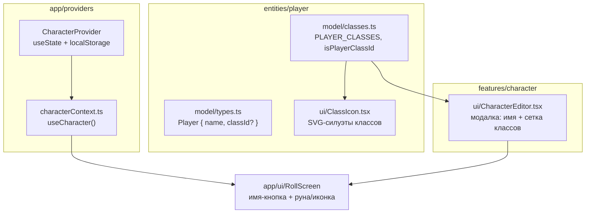

# Персонаж (герой): имя, класс и иконка-маркер

> Как устроено редактирование героя, где живут его данные и как класс превращается
> в иконку-маркер в шапке. Связанные темы: состояние —
> [state-management.md](./state-management.md), цвет/ореол — [theming.md](./theming.md).

## TL;DR

Герой — это **доменные данные игрока** (имя + опциональный класс), а не UI-настройка.
Поэтому они живут в отдельном провайдере `CharacterProvider` (а не в `Settings`) и
сохраняются в `localStorage` под ключом `ddr.character`. Редактор открывается **кликом
по имени** в шапке; выбранный класс заменяет «аморфную руну» перед именем на
SVG-иконку класса. Класс необязателен — без него остаётся руна.

## Почему отдельный провайдер, а не таб в настройках

Рассматривались два варианта: (1) разбить настройки на табы «Интерфейс/Герой» или
(2) отдельное окно редактора, открываемое по имени. Выбран **вариант 2**:

- `Settings` — это конфигурация приложения (тема, цвет, логи, анимации), локальная для
  клиента. `Character` — это **сущность игрока**, помеченная в модели как задел под
  мультиплеер («каждый бросок несёт автора»). Смешивать их в одном окне — размывать
  границу app-config ↔ доменное состояние.
- Под будущий мультиплеер редактор героя естественно ложится рядом с сущностью
  `player`, а не внутрь «настроек интерфейса».
- Клик по своему имени = «правлю свою идентичность» — прямая манипуляция в духе
  приложения, и окно настроек остаётся минималистичным.

## Слои и файлы (FSD-lite)

| Что | Где | Роль |
| --- | --- | --- |
| Реестр классов | [classes.ts](../src/entities/player/model/classes.ts) | 12 классов 5e (id + имя), `isPlayerClassId` |
| Модель игрока | [types.ts](../src/entities/player/model/types.ts) | `Player` с опциональным `classId`, сериализуема |
| Иконки классов | [ClassIcon.tsx](../src/entities/player/ui/ClassIcon.tsx) | плоские SVG-силуэты, цвет через `currentColor` |
| Состояние героя | [CharacterProvider.tsx](../src/app/providers/CharacterProvider.tsx) | `useState` + `localStorage` (`ddr.character`) |
| Хук/контекст | [characterContext.ts](../src/app/providers/characterContext.ts) | `useCharacter()` |
| Редактор | [CharacterEditor.tsx](../src/features/character/ui/CharacterEditor.tsx) | модалка: имя + выбор класса |

## Иконки классов

Каждый класс — узнаваемый минималистичный силуэт на холсте 100×100, нарисованный в
едином «линейном» ключе (обводка `currentColor`, `stroke-linecap/linejoin: round`).
Цвет наследуется из CSS, поэтому в шапке иконка красится акцентом палитры и
перекрашивается при смене темы — отдельной логики цвета в компоненте нет.

| Класс | Силуэт | Класс | Силуэт |
| --- | --- | --- | --- |
| Варвар | боевой топор | Паладин | щит с крестом |
| Бард | лютня | Следопыт | лук со стрелой |
| Жрец | лучащееся солнце | Плут | маска Зорро |
| Друид | лист с черешком и прожилками | Чародей | вспышка-звезда |
| Воин | меч с гардой | Колдун | печать-пентакль |
| Монах | инь-ян | Волшебник | палочка с искрой и лучами |

> Силуэты подбирались по **одному узнаваемому атрибуту** класса. Магическая троица
> разведена осмысленно: палочка-фокус → Волшебник (учёный маг), вспышка изнутри →
> Чародей (врождённая магия), печать-договор → Колдун (сделка с покровителем).

## Маркер в шапке: руна ↔ иконка

[RollScreen](../src/app/ui/RollScreen.tsx) показывает перед именем либо `ClassIcon`
(если `classId` задан), либо прежнюю «дышащую» руну-ромб. Оба варианта:

- окрашены акцентом палитры (`--accent`) и светятся ореолом кубика (`--die-halo`);
- «дышат» анимацией `rune-pulse` в такт сцене; при `reduced-motion` / опции «отключить
  анимации» дыхание гасится (класс `runeStill`).

Свечение иконки — **мягкий ореол вокруг** силуэта (два полупрозрачных `drop-shadow`
с `--die-halo`), без яркой заливки внутри, чтобы тонкие линии не «замыливались».
Имя — кнопка, открывающая редактор (клавиатурно доступна, `focus-visible`).

## Клавиатура в редакторе

Редактор рассчитан на быстрый ввод без мыши:

- поле имени получает `autoFocus` при открытии;
- **Enter** в поле имени — подтвердить и закрыть окно;
- **Tab** из поля имени — перейти к перебору классов (сетка `role="radiogroup"`);
- **Enter** на классе — выбрать класс и сразу закрыть окно (мышиный клик только
  выбирает, не закрывая); `preventDefault` гасит синтетический click, чтобы не
  сработать дважды.

## Персистентность и устойчивость

`CharacterProvider` читает `ddr.character` при инициализации и пишет туда при каждом
изменении. Чтение защищено: повреждённый JSON и недопустимый `classId` (проверка
`isPlayerClassId`) откатываются к значениям по умолчанию; ошибки записи (приватный
режим) игнорируются. Структура `{ name, classId? }` совпадает с редактируемой частью
`Player` — готова к передаче по сети в будущем мультиплеере.

## Тесты

- [classes.test.ts](../src/entities/player/model/classes.test.ts) — полнота реестра,
  уникальность id, `isPlayerClassId`, `createLocalPlayer` (сериализуемость).
- [CharacterEditor.test.tsx](../src/features/character/ui/CharacterEditor.test.tsx) —
  рендер, ввод имени, выбор/сброс класса, `aria-checked`, оверлей и вся клавиатура.
- [CharacterProvider.test.tsx](../src/app/providers/CharacterProvider.test.tsx) —
  дефолты, чтение/запись `localStorage`, игнор плохого класса и битого JSON, сброс.

## TODO / задел

- Мультиплеер: данные героя у каждого игрока в комнате; `RemoteRollSource` шлёт автора.
- Возможные поля героя: подкласс, уровень, цвет-акцент персонажа (свой `--accent`).
- Тематические иконки классов как кадры «перебора форм» (см.
  [dice-silhouettes.md](./dice-silhouettes.md), `FrameProvider`).
- **Закрытие/отмена редактора:** Esc для закрытия и/или кнопка «Сбросить» (сейчас
  закрытие только через Enter, клик вне панели или ✕).
- **Пустое имя:** сейчас имя можно стереть в ноль — стоит подставлять дефолт при
  пустом значении или запрещать сохранение пустого.
- **Имя/иконка в логах:** запись лога уже несёт автора (`Player`) — показать имя и
  иконку класса в `LogDrawer`, чтобы герой «появлялся» в истории бросков.
- **Цвет персонажа:** дать герою собственный `--accent` (см. поле выше) и применять
  его к иконке-маркеру и подсветке в логах.

