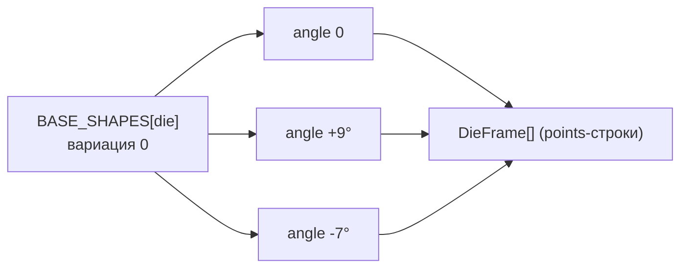

# Силуэты кубиков (SVG-геометрия)

> Как генерируются плоские формы кубиков и их вариации для «перебора форм», и какой
> задел оставлен под тематические силуэты.

## TL;DR

Каждый номинал рисуется как плоский SVG-`<polygon>` в координатах 100×100. «Перебор
форм» во время броска — это смена **вариаций одного и того же номинала** (повороты
базового силуэта на небольшой угол), поэтому кубик всегда «узнаётся»: d20 остаётся
d20. Файл: [geometry.ts](../src/entities/die/ui/geometry.ts).

## Базовые силуэты

Константы: `CENTER = 50`, `RADIUS = 44`. Помощник `regularPolygon(sides, rotationDeg)`
строит правильный многоугольник; для d10 — кастомный «воздушный змей» (`kite`).

| Номинал | Форма |
| ------- | ----- |
| d4 | треугольник вершиной вверх (`regularPolygon(3, -90)`) |
| d6 | квадрат с горизонтальными гранями (`regularPolygon(4, 45)`) |
| d8 | ромб (`regularPolygon(4, 0)`) |
| d10 | «воздушный змей» (`kite()`) |
| d12 | пятиугольник вершиной вверх (`regularPolygon(5, -90)`) |
| d20 | шестиугольник (`regularPolygon(6, 0)`) |
| d100 | десятиугольник (`regularPolygon(10, -90)`) |

> Это узнаваемые **символы** номиналов, а не точные развёртки многогранников —
> приоритет у плоского минимализма и читаемости.

## Вариации (кадры)

- `VARIATION_ANGLES = [0, 9, -7]` → `FRAMES_PER_DIE = 3`.
- `getDieFrames(die)` возвращает массив `DieFrame` (готовые строки `points` для
  `<polygon>`): вариация 0 — базовый силуэт, остальные — повороты вокруг центра.
- Во время броска [useRollAnimation](../src/shared/lib/useRollAnimation.ts) быстро
  переключает `frameIndex` между этими кадрами — отсюда ощущение кувыркания.

Вспомогательные функции: `rotatePoints` (поворот вокруг центра), `toPointsString`
(сериализация в атрибут `points`).

## Где используется

[Die.tsx](../src/entities/die/ui/Die.tsx) берёт кадр по `frameIndex` и рисует
`<polygon>` + число. Цвета — только из токенов темы (`var(--die-*)`), поэтому смена
темы/палитры перекрашивает силуэт автоматически (см. [theming.md](./theming.md)).

## TODO: тематические силуэты (FrameProvider)

Задел из [AGENTS.md](../AGENTS.md) (раздел 2): во время scramble можно подмешивать
тематические формы (монета, оружие, руны, символы магии) через отдельный «провайдер
кадров». Сейчас источник кадров один — повороты базового силуэта; в будущем
`getDieFrames` может стать частным случаем более общего `FrameProvider`, который
комбинирует геометрические и тематические кадры.

## Как добавить/изменить силуэт

1. Поправь запись в `BASE_SHAPES` (или добавь новый помощник формы рядом с `kite`).
2. При желании измени `VARIATION_ANGLES` — это глобально поменяет число и «характер»
   вариаций (и `FRAMES_PER_DIE`).
3. Координаты — в системе 100×100; держи фигуру в пределах `RADIUS` от центра, чтобы
   не обрезалось.
