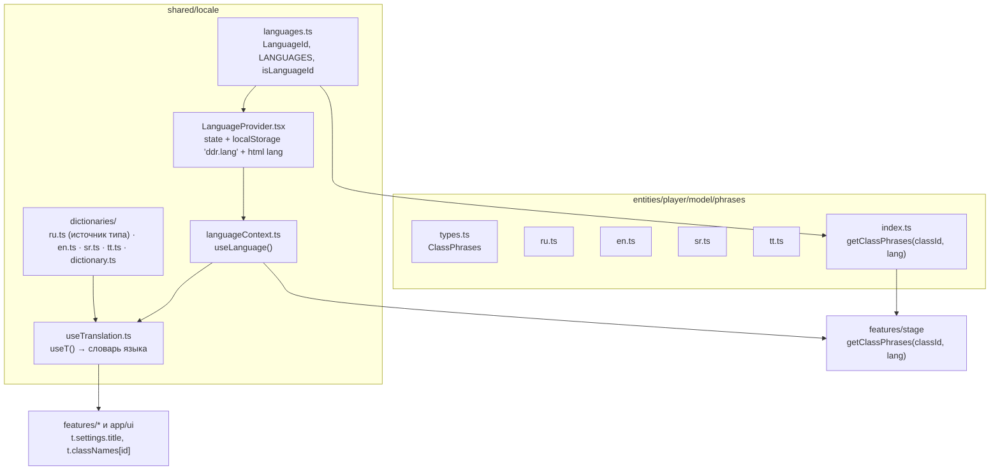

# Локализация (i18n) — переключение языка и строковые ресурсы

Приложение поддерживает несколько языков интерфейса (**RU + EN + SR + TT**) без
сторонних i18n-библиотек. Решение своё, лёгкое и типобезопасное — по тому же
паттерну, что оси оформления (`ShapeProvider` / `ColorProvider`).

> **Почему без библиотеки.** `i18next` и подобные решают плюрализацию,
> интерполяцию, namespaces, ленивую загрузку бандлов и детект языка. У нас два
> простых пласта строк: статичный UI и готовые наборы реплик. 90% возможностей
> библиотеки лежали бы мёртвым грузом, а свой словарь даёт автокомплит и проверку
> ключей средствами TypeScript «из коробки».

## Два пласта строк

| Пласт | Где живёт | Природа |
| --- | --- | --- |
| UI-обвязка (кнопки, заголовки, `aria-label`) | `shared/locale/dictionaries` | плоские короткие строки |
| Реплики персонажа по классам | `entities/player/model/phrases` | доменные сериализуемые данные |

Это ключевое разделение: реплики — **структурированные доменные данные** (наборы
по классам и фазам броска), поэтому версионируются по языку прямо в домене, а не в
UI-словаре.

## Архитектура

### Переключение языка

`LanguageProvider` — близнец `ColorProvider`: держит `lang` в state, сохраняет
выбор в `localStorage` (`ddr.lang`) и проставляет `<html lang="...">` (доступность
и SEO). Доступ — через `useLanguage()` (`{ lang, setLanguage }`). Переключатель
живёт в [SettingsPanel](../src/features/settings/ui/SettingsPanel.tsx) рядом с
темой и цветом — единое место для всех «осей оформления».

### UI-словари и `useT`

`ru.ts` — **источник истины формы словаря**: тип `Dictionary = typeof ru`. Любой
новый язык типизируется как `Dictionary`, поэтому забытый ключ — ошибка
компиляции, а не «тихая» дыра в переводе. Хук `useT()` возвращает словарь текущего
языка; в компонентах — типобезопасный доступ через вложенные поля:
`t.settings.title`, `t.classNames[classId]`.

> **Имена классов, стилей и палитр** локализуются через словарь по id:
> `t.classNames[id]`, `t.themeNames[id]`, `t.colorNames[id]`. В реестрах
> (`classes.ts`, `shapes.ts`, `colors.ts`) у элемента остаётся каноничное
> англоязычное `name` как стабильный дефолт/ключ, а показываемое имя берётся из
> словаря.

### Доменные реплики по языку

[getClassPhrases(classId, lang)](../src/entities/player/model/phrases/index.ts) —
чистая сериализуемая функция: язык приходит **параметром** (никакого React/DOM в
домене). [Stage](../src/features/stage/ui/Stage.tsx) берёт текущий язык из
`useLanguage()` и передаёт его в селектор; смена языка автоматически меняет набор
реплик (через зависимость `useMemo`).

> **Реплики переводим по духу, а не дословно.** В отличие от UI-словаря, набор
> фраз не обязан совпадать один-в-один: можно опускать часть реплик, менять их
> число и формулировки. Главное — сохранить **общий смысл и характер класса**;
> приветствуются идиомы и аналоги, естественные для языка/диалекта, вместо
> буквального перевода.

## Файлы

| Что | Где |
| --- | --- |
| Реестр языков | [languages.ts](../src/shared/locale/languages.ts) |
| Провайдер языка | [LanguageProvider.tsx](../src/shared/locale/LanguageProvider.tsx) |
| Контекст/хук | [languageContext.ts](../src/shared/locale/languageContext.ts) |
| Переводчик UI | [useTranslation.ts](../src/shared/locale/useTranslation.ts) |
| Словари UI | [ru.ts](../src/shared/locale/dictionaries/ru.ts) · [en.ts](../src/shared/locale/dictionaries/en.ts) · [sr.ts](../src/shared/locale/dictionaries/sr.ts) · [tt.ts](../src/shared/locale/dictionaries/tt.ts) · [dictionary.ts](../src/shared/locale/dictionaries/dictionary.ts) |
| Public API | [index.ts](../src/shared/locale/index.ts) |
| Реплики (домен) | [phrases/](../src/entities/player/model/phrases/) |

## Как добавить язык

1. В [languages.ts](../src/shared/locale/languages.ts) добавь `LanguageId` и строку
   в `LANGUAGES` — переключатель в настройках подхватит автоматически.
2. Создай `shared/locale/dictionaries/<lang>.ts` (типизирован как `Dictionary` —
   TS подскажет недостающие ключи) и подключи его в `dictionary.ts`.
3. Создай `entities/player/model/phrases/<lang>.ts` и подключи в
   `phrases/index.ts` (карта `PHRASES_BY_LANG`).
