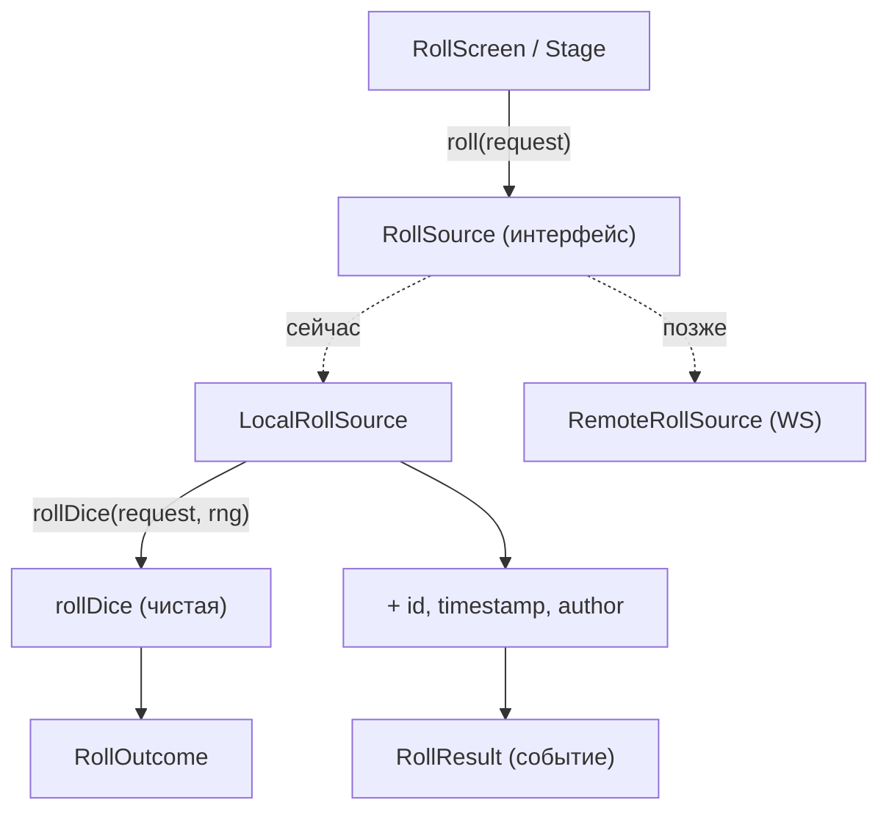
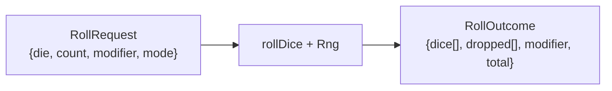

# Доменное ядро броска и задел под мультиплеер

> Как устроена «честная» логика броска, почему она чистая и сериализуемая, и где
> проходит «шов» для будущей сетевой игры.

## TL;DR

Бросок — это **чистая функция** `rollDice(request, rng)` без побочных эффектов,
плюс тонкий сервисный слой `RollSource`, который добавляет метаданные события
(id, время, автор). RNG инъектируется. Всё спроектировано так, чтобы локальный
бросок позже можно было заменить на сетевой, не трогая UI.



## Чистое ядро: rollDice

Файл: [rollDice.ts](../src/entities/roll/lib/rollDice.ts).

- Детерминирована: при одинаковом `Rng` всегда даёт одинаковый исход.
- Никаких `Date.now`/`crypto`/DOM — только вычисление.
- Обрабатывает количество кубиков, модификатор и режим.

**Advantage/Disadvantage:** бросается **пул** из `count` костей; одна остаётся
`kept` (наибольшая при `advantage`, наименьшая при `disadvantage`), остальные —
`dropped` (для прозрачного отображения и подсветки победителя на сцене). Размер
пула задаёт `count`: **2** — обычное преимущество/помеха, **3** — «эльфийская
меткость» (`advantage` с пулом 3). Так черта Elven Accuracy выражается самой
механикой, без отдельного флага. В обычном режиме `count` — это сумма (3d6 и т.п.).

> В UI это разведено: для d20 показан единый переключатель
> «помеха · обычный · преимущество · эльфийская меткость» (он же задаёт `count`),
> у остальных кубиков — счётчик количества (сумма). См.
> [RollControls.tsx](../src/features/roll-controls/ui/RollControls.tsx).



## RNG как зависимость

Файл: [rng.ts](../src/shared/lib/rng.ts).

```ts
interface Rng { next(): number } // [0, 1)
```

- Домен **никогда** не зовёт `Math.random()` напрямую — только через `Rng`.
- Даёт тестируемость (детерминированный генератор в тестах).
- `rollSingleDie(rng, sides)` → целое в `[1, sides]`.

### Реализации

- `createCryptoRng()` — **дефолтная** для бросков (`createLocalRollSource`).
  На основе `crypto.getRandomValues`: непредсказуема (нельзя угадать исход) и
  даёт качественную энтропию. Откатывается на `Math.random`, если `crypto`
  недоступен. Остаточный modulo bias при раскладке на грани ~2^-32 — неощутим.
- `createMathRandomRng()` — на `Math.random()`. Используется там, где честность
  не критична (например, выбор реплик героя в `useShuffleBag`).

### Seedable RNG — отложено (обсудить при мультиплеере)

Детерминированный по seed генератор **сознательно не добавлен**. Он нужен только в
модели, где **клиенты сами вычисляют** бросок из общего зерна (P2P / без
авторитетного сервера). При выбранной здесь архитектуре «`RemoteRollSource` шлёт
готовый `RollResult`» (авторитетный сервер) seed **не требуется** — серверу
достаточно crypto-RNG, а клиенты лишь проигрывают пришедшие значения.

> **TODO (мультиплеер):** окончательно решить про seed при переходе на сетевую
> игру. Если останемся на авторитетном сервере — seedable не нужен; если выберем
> P2P/детерминированное воспроизведение — добавить seedable PRNG за тем же
> интерфейсом `Rng`.

## Событие броска: RollResult

Типы: [types.ts](../src/entities/roll/model/types.ts).

- `RollOutcome` — чистый исход (`dice`, `dropped`, `modifier`, `total`).
- `RollResult extends RollOutcome` — добавляет метаданные события: `id`, `request`,
  `author` ([Player](../src/entities/player/model/types.ts)), `timestamp`.

Все типы **сериализуемы** — сознательное ограничение: бросок должен быть
самодостаточным объектом, который можно сохранить или передать по сети без потери
смысла.

## Шов под мультиплеер: RollSource

Файл: [RollSource.ts](../src/shared/services/RollSource.ts).

```ts
interface RollSource {
  roll(request: RollRequest): Promise<RollResult>
}
```

- **Сейчас:** `createLocalRollSource({ rng, getAuthor, createId, now })` — считает
  исход через `rollDice` и дополняет метаданными. Все зависимости инъектируются ради
  тестируемости; `createId` по умолчанию — `crypto.randomUUID`.
- **Позже:** `RemoteRollSource` (WebSocket) — тот же интерфейс, другой источник. UI и
  состояние не узнают разницы.
- Метод **асинхронный намеренно** — локальная реализация резолвится сразу, но
  сигнатура уже готова к сетевой задержке.

## Принципы задела (из AGENTS.md, раздел 3)

1. Бросок — чистая сериализуемая доменная функция (событие с id/запросом/костями/
   итогом/временем/автором).
2. RNG инъектируется (на будущее — seed от сервера/ГМ).
3. Источник бросков за интерфейсом `RollSource` (Local → Remote).
4. Понятия `player`/`room` заложены в типах с самого начала.
5. Состояние — через reducer/события (`ROLL_ADDED`): тот же редьюсер обработает
   события из сети (см. [state-management.md](./state-management.md)).

## Тесты

[rollDice.test.ts](../src/entities/roll/lib/rollDice.test.ts) — детерминизм через
подставной `sequenceRng`, проверка count/modifier/advantage/disadvantage.

## Почему так

- **Чистота домена** — логику легко тестировать и переносить на сервер.
- **Инъекция RNG** — единственный источник случайности, контролируемый и
  воспроизводимый.
- **Интерфейс источника** — добавление сети не потребует переписывать UI, только
  новую реализацию `RollSource`.
