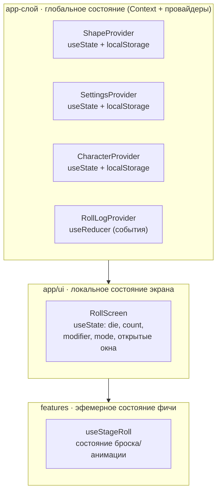
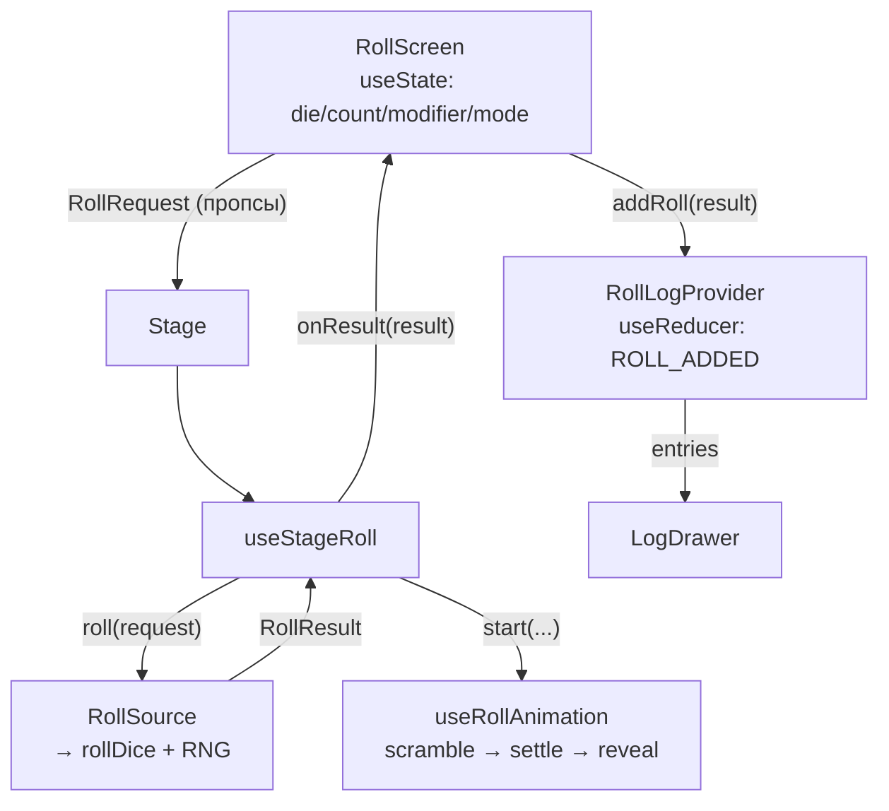
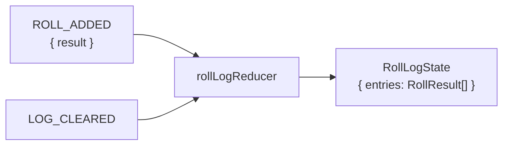

# Управление состоянием (State Management)

> Как организовано состояние в приложении и почему именно так.

## TL;DR

Внешних библиотек состояния (Redux, Zustand, MobX) **нет**. Всё построено на
встроенных средствах React (`useState`, `useReducer`, `Context`) и организовано
по слоям FSD-lite. Состояние разделено на три уровня по «времени жизни» и области видимости.

## Три уровня состояния

### 1. Глобальное состояние — Context + провайдеры

Живёт в `src/app/providers` и `src/shared/theme`. Композируется в
[AppProviders.tsx](../src/app/providers/AppProviders.tsx):
`ShapeProvider → ColorProvider → SettingsProvider → CharacterProvider → RollLogProvider`.

| Состояние | Где | Механизм | Хук доступа |
|-----------|-----|----------|-------------|
| Лог бросков | [RollLogProvider.tsx](../src/app/providers/RollLogProvider.tsx) | `useReducer` + [logReducer.ts](../src/entities/roll/model/logReducer.ts) | `useRollLog()` |
| Настройки UI | [SettingsProvider.tsx](../src/app/providers/SettingsProvider.tsx) | `useState` + `localStorage` | `useSettings()` |
| Герой (имя, класс) | [CharacterProvider.tsx](../src/app/providers/CharacterProvider.tsx) | `useState` + `localStorage` | `useCharacter()` |
| Стиль (форма) | [ShapeProvider.tsx](../src/shared/theme/shape/ShapeProvider.tsx) | `useState` + `localStorage` + `data-theme-shapes` | `useShape()` |
| Палитра (цвет) | [ColorProvider.tsx](../src/shared/theme/color/ColorProvider.tsx) | `useState` + `localStorage` + `data-theme-colors` | `useColor()` |

**Паттерн React 19:** контекст и хук вынесены в отдельный `.ts`-файл (например
[rollLogContext.ts](../src/app/providers/rollLogContext.ts)), а компонент-провайдер —
в `.tsx`. Это требование правила `react-refresh` (быстрый HMR не любит, когда из
одного файла экспортируются и компонент, и не-компонент).

### 2. Локальное состояние экрана — `useState`

Текущий «черновик броска» (что выбрано в UI) живёт прямо в
[RollScreen.tsx](../src/app/ui/RollScreen.tsx):

- `die`, `count`, `modifier`, `mode` → из них собирается `RollRequest`;
- `settingsOpen`, `characterOpen`, `logOpen` → открыты ли модалки настроек,
  редактора героя и drawer логов.

Оно не глобальное намеренно: это сиюминутный выбор пользователя, не нужный
другим частям дерева и не переживающий перезагрузку.

### 3. Эфемерное состояние фичи — кастомный хук

Состояние самого процесса броска **не глобальное** — оно в
[useStageRoll.ts](../src/features/stage/model/useStageRoll.ts), который оркестрирует
три источника:

- жест → [usePressAndShake.ts](../src/shared/lib/usePressAndShake.ts);
- честный результат → `RollSource` ([RollSource.ts](../src/shared/services/RollSource.ts));
- анимация → [useRollAnimation.ts](../src/shared/lib/useRollAnimation.ts).

## Поток данных (однонаправленный)

Данные текут строго **вниз** (пропсами), а наверх — только через колбэки
(`onResult`, `addRoll`). Это соответствует правилу FSD «импорты только вниз»:
фичи (`stage`, `settings`, `log`) не лезут в `app`, а получают всё пропсами.

## Событийная модель лога

Лог построен не на «изменении переменной», а на **событиях** через редьюсер:

Детали в [logReducer.ts](../src/entities/roll/model/logReducer.ts):
- `ROLL_ADDED` — добавляет результат в начало списка, обрезает до `ROLL_LOG_LIMIT` (100);
- `LOG_CLEARED` — очищает.

Редьюсер покрыт тестами: [logReducer.test.ts](../src/entities/roll/model/logReducer.test.ts).

## Почему так

- **Без внешних библиотек** — для учебного проекта `useReducer` + `Context` достаточно;
  меньше зависимостей и «магии».
- **Событийный редьюсер — задел под мультиплеер.** Тот же `rollLogReducer` позже
  обработает события `ROLL_ADDED`, пришедшие по сети, без переписывания UI
  (см. [AGENTS.md](../AGENTS.md), раздел 3 «Онлайн и мультиплеер»).
- **Бросок — чистая сериализуемая функция** (`rollDice` + инъекция `Rng`):
  доменная логика отделена от React и DOM, легко тестируется и переносится на сервер.
- **Разделение по времени жизни** — глобальное (переживает навигацию/перезагрузку),
  экранное (сиюминутный выбор), эфемерное (живёт только во время броска).

## Связанные нюансы

- **Сброс сцены при смене параметров.** В `useStageRoll` при изменении сигнатуры
  `die|count|modifier|mode` состояние анимации и `lastResult` сбрасываются — иначе
  на сцене остались бы «чужие» значения и старое количество кубиков. Реализовано
  React-паттерном «корректировка состояния во время рендера» (без `useEffect`),
  чтобы не плодить каскадные ре-рендеры.
