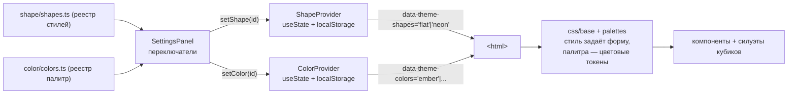

# Система тем (Theming)

> Как устроено оформление, как добавляются темы и план разделения темы на
> независимые оси «стиль» и «цвет».

## TL;DR

Тема — это набор **семантических CSS-переменных** (токенов), применяемых через
**две независимые оси** на `<html>`: атрибут `data-theme-shapes` задаёт **стиль**
(форма/тени/свечение: `flat` / `neon`), атрибут `data-theme-colors` — **цветовую
палитру** (`ember` / `frost` / `nature` / `arcane` / `crimson` / `storm` /
`radiant` / `necrotic` / `darkness` / `charm`). Компоненты и SVG-силуэты кубиков
используют **только** токены (`var(--accent)`, `var(--die-fill)` …), поэтому смена
любой оси перекрашивает весь UI мгновенно, без ре-рендера React. Тонкие TS-обёртки
(`ShapeProvider` + `SHAPES`, `ColorProvider` + `COLORS`) хранят выбор и рисуют
переключатели. Оси независимы: любой стиль свободно сочетается с любой палитрой.

## Как сейчас (две независимые оси)

> **Почему `data-*`?** Префикс `data-` — это требование стандарта HTML5 для
> любых кастомных атрибутов (иначе — невалидный HTML и нет удобного `element.dataset`
> API). Смысловую часть после `data-` выбираем мы: `theme-shapes` (форма) и
> `theme-colors` (цвет). В JS они читаются как `dataset.themeShapes` / `dataset.themeColors`.

### Принцип разделения осей

- **Ось «стиль»** (`data-theme-shapes`): форма и поведение — тени, свечение
  (`--die-glow`), скругления, контраст поверхностей, базовая светлота (`color-scheme`),
  а также базовые значения акцентных токенов.
- **Ось «цвет»** (`data-theme-colors`): акцентная палитра — переопределяет только
  `--accent`, `--accent-hover`, `--accent-contrast` и `--accent-secondary`
  (вторичный акцент: используется в градиенте имени игрока, линии под шапкой и в
  «перекрашивающихся» свечениях сцены).
- **Кубик реагирует на цвет автоматически.** Токены `--die-fill-active`, `--die-halo`
  (и в неоне — `--die-stroke`, `--die-glow`) выводятся из `var(--accent)` через
  `color-mix` прямо в блоках стиля. CSS-переменные резолвятся лениво (в момент
  использования), поэтому палитре достаточно задать один `--accent` — цвет «протекает»
  в заливку/свечение кубика без комбинаторного взрыва (стиль × палитра).
- В CSS блоки палитры идут **после** блоков стиля и переопределяют только цветовые
  токены, не трогая форму. Так любой стиль сочетается с любой палитрой.

> **Названия стилей и палитр локализуются.** В реестрах `shapes.ts`/`colors.ts`
> поле `name` — каноничный англоязычный дефолт/ключ; в переключателе настроек
> подпись берётся из словаря по id (`t.themeNames[id]`, `t.colorNames[id]`). См.
> [localization.md](./localization.md).

### Файлы

| Файл | Роль |
|------|------|
| [css/base.css](../src/shared/theme/css/base.css) | Ось «стиль» (`:root[data-theme-shapes='...']`) + базовые семантические токены |
| [css/palettes.css](../src/shared/theme/css/palettes.css) | Ось «цвет» (`:root[data-theme-colors='...']`) — палитры по алфавиту, переопределяют акценты |
| [css/animations.css](../src/shared/theme/css/animations.css) | Keyframes: свечение сцены (`glow-*`), дыхание кубика (`die-glow-pulse*`), дрейф (`drift-*`) |
| [shape/shapes.ts](../src/shared/theme/shape/shapes.ts) | Реестр стилей: `ShapeId`, метаданные, превью, `DEFAULT_SHAPE_ID` (поле `name` — каноничный дефолт; локализованные имена — в словаре, см. ниже) |
| [color/colors.ts](../src/shared/theme/color/colors.ts) | Реестр палитр: `ColorId`, метаданные, превью, `DEFAULT_COLOR_ID` (поле `name` — каноничный дефолт; локализованные имена — в словаре, см. ниже) |
| [shape/ShapeProvider.tsx](../src/shared/theme/shape/ShapeProvider.tsx) | Хранит стиль, пишет `data-theme-shapes`, `localStorage` (`ddr.shape`); дефолт — `neon` (`DEFAULT_SHAPE_ID`), при первом запуске отдаёт `flat` только если система явно просит светлую схему (`prefers-color-scheme: light`) |
| [shape/shapeContext.ts](../src/shared/theme/shape/shapeContext.ts) | Контекст + хук `useShape()` |
| [color/ColorProvider.tsx](../src/shared/theme/color/ColorProvider.tsx) | Хранит палитру, пишет `data-theme-colors`, `localStorage` (`ddr.color`) |
| [color/colorContext.ts](../src/shared/theme/color/colorContext.ts) | Контекст + хук `useColor()` |

### Токены (семантические)

Поверхности/текст: `--bg`, `--surface`, `--surface-elevated`, `--text`,
`--text-muted`, `--border`, `--shadow`.
Акцент (задаётся стилем, переопределяется палитрой): `--accent`, `--accent-hover`,
`--accent-contrast`, `--accent-soft` (приглушённая заливка элементов),
`--accent-secondary` (вторичный акцент — градиент имени, линия под шапкой,
перекрашивающиеся свечения), `--control-on-accent` (цвет глифа контролов −/+/⚙/перо
на hover-заливке акцентом: на flat светлый «выворотка», на neon тёмный
`--accent-contrast`).
Результат: `--crit-success`, `--crit-fail`.
Кубик: `--die-stroke`, `--die-stroke-width`, `--die-fill`, `--die-fill-active`,
`--die-text`, `--die-glow`, `--die-halo`, `--die-pulse` (дыхание свечения кубика
на сцене: keyframes `die-glow-pulse` в неоне и мягче `die-glow-pulse-soft` на flat;
гасится вместе с прочими анимациями). Кубик дышит **в такт сцене**: длительность
`--die-pulse-duration` по умолчанию берётся из `--stage-pulse-duration`
(`var(--stage-pulse-duration, 3.2s)` в base.css), а этот токен каждая палитра
задаёт рядом со своим `--stage-pulse` и им же питает анимацию свечения сцены —
единый источник ритма, поэтому пульс кубика и дыхание сцены всегда совпадают по
периоду (crimson 6.75s, ember 3.6s, storm 14s и т.д.). На flat контур
`--die-stroke` — почти чёрный с подтоном акцента (`color-mix(... 45%, #14171d)`),
чтобы силуэт был связан со свечением.
Сцена: `--stage-glow` — сила базового свечения сцены броска (задаётся стилем:
на тёмном неоне ярче, чем на светлом flat); `--stage-pulse` — «характер»
пульсации свечения (задаётся **палитрой**: огонь мерцает, холод переливается,
молния вспыхивает и т.д.; масштабирует `--stage-glow` через keyframes
`glow-fire`/`glow-frost`/`glow-steady`/`glow-nature`/`glow-storm`/`glow-radiant`/`glow-arcane`/`glow-necrotic`/`glow-charm`/`glow-crimson`).
Часть архетипов (`glow-nature`, `glow-arcane`, `glow-necrotic`, `glow-charm`, а также `glow-fire`)
ещё и **перекрашивают** свечение по ходу цикла — сезонный сдвиг зелёный→золото у nature,
фиолетовый↔голубой у arcane, кислотно-зелёный↔тёмно-фиолетовый у necrotic, а у огня
оттенок плавает к `--accent-secondary` на пике жара. `glow-storm` дополнительно
кратко заливает `background` трея бело-голубой зарницей в момент разряда.
`--stage-drift` — второй, независимый слой эмоции: едва заметный микро-дрейф сцены
(keyframes `drift-fire`/`drift-frost`/`drift-storm`), живёт на свойствах
`translate`/`rotate` (НЕ `transform`), поэтому не конфликтует со встряской при
зажатии и складывается с ней. У storm дрейф синхронизирован с `glow-storm`
(одинаковые 14s linear) — дрожь сцены совпадает со вспышкой. У crimson этот
слой вместо дрейфа — «дыхание» живого организма: `breath-crimson` медленно
расширяет/сжимает сцену на свойстве `scale` (тоже не `transform`)
**синхронно** с пульсом `glow-crimson` — то же время (`--stage-pulse-duration`
6.75s) и тот же пик (33.3%): свет густеет ровно тогда, когда сцена расширяется,
вдох коротким (до 33%), выдох вдвое длиннее — единый вдох всем телом. Гасится
вместе с `--stage-pulse` (`.still` / `prefers-reduced-motion` / `.shaking`).

У crimson есть и третий слой — **кубик на сцене «питается кровью»**: силуэт
(`.shape`) наливается алым на вдохе и опадает на выдохе (keyframes `die-bleed`,
анимирует `fill`: `--die-fill` смешивается с `--accent`), в том же ритме и пике,
что дыхание сцены. Эффект включён **только на сценовом кубике**: палитра задаёт
токен `--die-bleed`, который «вооружается» классом `.glow`
([Stage.module.css](../src/features/stage/ui/Stage.module.css)) через
`--die-fill-pulse` и наследуется вниз в `.shape`
([Die.module.css](../src/entities/die/ui/Die.module.css)). Кубики ленты выбора
не затрагиваются; гасится при `.shaking` (jitter) и `prefers-reduced-motion`.

Аркана дополнительно несёт **орбитальный слой**: два размытых овала-ауры
(`.tray::before` — голубой, `.tray::after` — фиолетовый), уведённых за трей
(`z-index: -1`, `filter: blur`), бегут по периметру сцены (keyframes
`arcane-orbit`, двигают `left`/`top` в % от трея) и читаются не фигурами, а
подвижным свечением — «танцем» вокруг дышащих аур `glow-arcane`. Второй овал
стартует напротив первого (`animation-delay: calc(duration / -2)`). Слой
включается **палитрой** через токены `--stage-spark-display`
(по умолчанию `none` в [base.css](../src/shared/theme/css/base.css)),
`--stage-spark-color` / `--stage-spark-2-color`, `--stage-spark-size` /
`--stage-spark-height`, `--stage-spark-duration` и `--stage-spark-anim`
(анимация передаётся **токеном**, а не именем keyframes напрямую — иначе CSS
Modules переименует имя; см. [animation-and-gesture](./animation-and-gesture.md)).
Гасится вместе с прочей эмоцией на `.still` / `.shaking`.

> **Орбитальные ауры не должны двигать скролл.** Овалы — абсолютно
> спозиционированные блоки фиксированного размера (`left`/`top` в % от трея) и
> чисто декоративные (несут только свечение). На **узком** экране их box
> высовывается за пределы контента, динамически раздувая горизонтальный overflow
> документа → горизонтальный скролл «пляшет» в такт орбите. Решение — клип
> **на уровне вьюпорта**: `#root` (во всю ширину экрана) несёт `overflow-x: clip`
> ([global.css](../src/app/styles/global.css)). Так свечение обрезается ровно по
> краю экрана: всё, что влезает, показывается (на широком экране ауры красиво
> ложатся в боковые поля за пределами колонки 720px), а вышедшее за вьюпорт — и
> так невидимое — отсекается. Никаких порогов-медиазапросов: ширина «подбирается»
> автоматически на любом экране, декоративные ауры просто перестают участвовать в
> расчёте необходимости скролла. `clip` (а не `hidden`) не создаёт скролл-контейнер
> и не трогает вертикальный скролл; `#root` без `transform/filter/contain` не
> становится containing block для `fixed`, поэтому выезжающие панели (Drawer,
> диалоги) не обрезаются.

**Правило:** компоненты не используют «сырые» цвета — только токены отсюда.

### Тематизация шапки и контролов

Чтобы тема ощущалась во всём UI, а не только на сцене:

- **Шапка** ([RollScreen](../src/app/ui/RollScreen.tsx)): имя игрока залито
  градиентом `--accent → --accent-secondary` (через `background-clip: text`; конец
  градиента подмешан к `--text`, чтобы почти-белые вторичные цвета не сливались на
  светлой теме). Слева — руна-ромб цвета `--accent` со свечением `--die-halo`,
  «дышащая» в такт сцене (`rune-pulse`, гасится при reduced-motion). Под шапкой —
  градиентная линия `--accent → --accent-secondary` (`border-image`).
- **Контролы** (`Stepper`, `IconButton`, `Drawer`-хэндл): глифы −/+, ⚙ и перо
  окрашены в `--accent`; кружки ⚙/пера имеют лёгкую акцентную подложку
  (`color-mix(--accent 12%, --surface)`). На hover — заливка `--accent`, глиф
  `--control-on-accent`. Поведение единое во всех контролах.

## Куда движемся (Этап 2)

Этап 1 (две независимые оси: стиль + цвет) реализован. Дальнейшие планы:

- Отдельный выбор вторичного акцента (`--accent-secondary`) в настройках.
- Кастомный цвет через color picker.
- Живое превью палитры прямо на сцене.

### Почему так

- **CSS-переменные + `data-*`** дают развязку без затрат: вторая ось — это ещё один
  атрибут и ещё один слой переменных, ядро менять не нужно.
- **Без ре-рендера React** при смене цвета — браузер сам перекрашивает по токенам.
- **Симметрия провайдеров** — `ColorProvider` повторяет проверенный паттерн
  `ShapeProvider`, поэтому код предсказуем и тестируем.

## Как добавить новый стиль (ось «форма»)

1. В [css/base.css](../src/shared/theme/css/base.css) добавь блок
   `:root[data-theme-shapes='<id>'] { ... }` со всеми токенами.
2. В [shape/shapes.ts](../src/shared/theme/shape/shapes.ts) расширь `ShapeId` и массив `SHAPES`
   (имя + превью + `scheme`).
3. Переключатель в настройках подхватит стиль автоматически (он строится из `SHAPES`).

## Как добавить новую палитру (ось «цвет»)

Палитры повторяют **стихийный круг D&D** (типы урона / внутренние планы), чтобы
названия и цвета были узнаваемы:

| Палитра | Стихия D&D | Базовый цвет |
|---------|-----------|--------------|
| `ember` | Fire / Огонь | оранжево-красный |
| `frost` | Cold / Лёд | ледяной голубой |
| `nature` | Nature·Poison / Природа | зелёный |
| `arcane` | Force·Arcane / Магия | фиолетовый |
| `crimson` | Blood / Кровь | алый |
| `storm` | Lightning·Air / Молния | электрический жёлтый |
| `radiant` | Radiant / Свет | divine-золото (чистый свет) |
| `necrotic` | Necrotic / Некротика | призрачно-зелёный → тёмно-фиолетовый (нежить) |
| `darkness` | Shadow / Тьма | монохром: тёмное свечение на flat, белое на neon |
| `charm` | Charm·Enchantment / Очарование | розовый (любовные чары) |

> **Зависимость от стиля (исключение).** Обычно палитра задаёт один `--accent`
> и не зависит от оси «форма». Палитра `darkness` — осознанное исключение: на flat
> акцент почти-чёрный (тёмное свечение на светлом фоне), а на neon такое свечение
> не видно, поэтому комбинированный селектор
> `:root[data-theme-shapes='neon'][data-theme-colors='darkness']` переопределяет
> акцент на светло-белый. Каскад решает за счёт большей специфичности, остальные
> палитры остаются стиле-независимыми.

1. В [css/palettes.css](../src/shared/theme/css/palettes.css) добавь блок
   `:root[data-theme-colors='<id>'] { ... }` только с акцентными токенами
   (`--accent`, `--accent-hover`, `--accent-contrast`, `--accent-secondary`).
   Цвет кубика (заливка/ореол/свечение) подхватится автоматически — он
   выведён из `var(--accent)` в блоках стиля. Ключевые кадры свечения —
   в [css/animations.css](../src/shared/theme/css/animations.css).
2. В [color/colors.ts](../src/shared/theme/color/colors.ts) расширь `ColorId` и массив `COLORS`.
3. Переключатель «Цвет» в настройках подхватит палитру автоматически.
