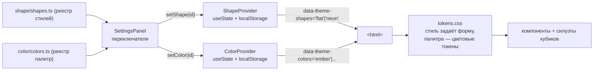

# Система тем (Theming)

> Как устроено оформление, как добавляются темы и план разделения темы на
> независимые оси «стиль» и «цвет».

## TL;DR

Тема — это набор **семантических CSS-переменных** (токенов), применяемых через
**две независимые оси** на `<html>`: атрибут `data-theme-shapes` задаёт **стиль**
(форма/тени/свечение: `flat` / `neon`), атрибут `data-theme-colors` — **цветовую
палитру** (`ember` / `frost` / `forest` / `arcane` / `crimson` / `storm` /
`radiant` / `necrotic`). Компоненты и SVG-силуэты кубиков
используют **только** токены (`var(--accent)`, `var(--die-fill)` …), поэтому смена
любой оси перекрашивает весь UI мгновенно, без ре-рендера React. Тонкие TS-обёртки
(`ShapeProvider` + `SHAPES`, `ColorProvider` + `COLORS`) хранят выбор и рисуют
переключатели. Оси независимы: любой стиль свободно сочетается с любой палитрой.

## Как сейчас (две независимые оси)

> **Почему `data-*`?** Префикс `data-` — это требование стандарта HTML5 для
> любых кастомных атрибутов (иначе — невалидный HTML и нет удобного `element.dataset`
> API). Смысловую часть после `data-` выбираем мы: `theme-shapes` (форма) и
> `theme-colors` (цвет). В JS они читаются как `dataset.themeShapes` / `dataset.themeColors`.

### Принцип разделения осей

- **Ось «стиль»** (`data-theme-shapes`): форма и поведение — тени, свечение
  (`--die-glow`), скругления, контраст поверхностей, базовая светлота (`color-scheme`),
  а также базовые значения акцентных токенов.
- **Ось «цвет»** (`data-theme-colors`): акцентная палитра — переопределяет только
  `--accent`, `--accent-hover`, `--accent-contrast` и (задел) `--accent-secondary`.
- **Кубик реагирует на цвет автоматически.** Токены `--die-fill-active`, `--die-halo`
  (и в неоне — `--die-stroke`, `--die-glow`) выводятся из `var(--accent)` через
  `color-mix` прямо в блоках стиля. CSS-переменные резолвятся лениво (в момент
  использования), поэтому палитре достаточно задать один `--accent` — цвет «протекает»
  в заливку/свечение кубика без комбинаторного взрыва (стиль × палитра).
- В CSS блоки палитры идут **после** блоков стиля и переопределяют только цветовые
  токены, не трогая форму. Так любой стиль сочетается с любой палитрой.

### Файлы

| Файл | Роль |
|------|------|
| [tokens.css](../src/shared/theme/tokens.css) | Токены: блоки стиля (`:root[data-theme-shapes='...']`) и блоки палитр (`:root[data-theme-colors='...']`) |
| [shape/shapes.ts](../src/shared/theme/shape/shapes.ts) | Реестр стилей: `ShapeId`, метаданные, превью, `DEFAULT_SHAPE_ID` |
| [color/colors.ts](../src/shared/theme/color/colors.ts) | Реестр палитр: `ColorId`, метаданные, превью, `DEFAULT_COLOR_ID` |
| [shape/ShapeProvider.tsx](../src/shared/theme/shape/ShapeProvider.tsx) | Хранит стиль, пишет `data-theme-shapes`, `localStorage` (`ddr.shape`), учитывает `prefers-color-scheme` |
| [shape/shapeContext.ts](../src/shared/theme/shape/shapeContext.ts) | Контекст + хук `useShape()` |
| [color/ColorProvider.tsx](../src/shared/theme/color/ColorProvider.tsx) | Хранит палитру, пишет `data-theme-colors`, `localStorage` (`ddr.color`) |
| [color/colorContext.ts](../src/shared/theme/color/colorContext.ts) | Контекст + хук `useColor()` |

### Токены (семантические)

Поверхности/текст: `--bg`, `--surface`, `--surface-elevated`, `--text`,
`--text-muted`, `--border`, `--shadow`.
Акцент (задаётся стилем, переопределяется палитрой): `--accent`, `--accent-hover`,
`--accent-contrast`, `--accent-soft` (приглушённая заливка элементов),
`--accent-secondary` (задел).
Результат: `--crit-success`, `--crit-fail`.
Кубик: `--die-stroke`, `--die-stroke-width`, `--die-fill`, `--die-fill-active`,
`--die-text`, `--die-glow`, `--die-halo`.
Сцена: `--stage-glow` — сила базового свечения сцены броска (задаётся стилем:
на тёмном неоне ярче, чем на светлом flat); `--stage-pulse` — «характер»
пульсации свечения (задаётся **палитрой**: огонь мерцает, холод переливается,
молния вспыхивает и т.д.; масштабирует `--stage-glow` через keyframes
`glow-fire`/`glow-frost`/`glow-steady`/`glow-forest`/`glow-storm`/`glow-radiant`/`glow-arcane`/`glow-necrotic`).
Часть архетипов (`glow-forest`, `glow-arcane`, `glow-necrotic`) ещё и **перекрашивают**
свечение по ходу цикла — сезонный сдвиг зелёный→золото у forest, фиолетовый↔голубой
у arcane, кислотно-зелёный↔тёмно-фиолетовый у necrotic.

**Правило:** компоненты не используют «сырые» цвета — только токены отсюда.

## Куда движемся (Этап 2)

Этап 1 (две независимые оси: стиль + цвет) реализован. Дальнейшие планы:

- Отдельный выбор вторичного акцента (`--accent-secondary`) в настройках.
- Кастомный цвет через color picker.
- Живое превью палитры прямо на сцене.

### Почему так

- **CSS-переменные + `data-*`** дают развязку без затрат: вторая ось — это ещё один
  атрибут и ещё один слой переменных, ядро менять не нужно.
- **Без ре-рендера React** при смене цвета — браузер сам перекрашивает по токенам.
- **Симметрия провайдеров** — `ColorProvider` повторяет проверенный паттерн
  `ShapeProvider`, поэтому код предсказуем и тестируем.

## Как добавить новый стиль (ось «форма»)

1. В [tokens.css](../src/shared/theme/tokens.css) добавь блок
   `:root[data-theme-shapes='<id>'] { ... }` со всеми токенами.
2. В [shape/shapes.ts](../src/shared/theme/shape/shapes.ts) расширь `ShapeId` и массив `SHAPES`
   (имя + превью + `scheme`).
3. Переключатель в настройках подхватит стиль автоматически (он строится из `SHAPES`).

## Как добавить новую палитру (ось «цвет»)

Палитры повторяют **стихийный круг D&D** (типы урона / внутренние планы), чтобы
названия и цвета были узнаваемы:

| Палитра | Стихия D&D | Базовый цвет |
|---------|-----------|--------------|
| `ember` | Fire / Огонь | оранжево-красный |
| `frost` | Cold / Лёд | ледяной голубой |
| `forest` | Nature·Poison / Природа | зелёный |
| `arcane` | Force·Arcane / Магия | фиолетовый |
| `crimson` | Blood / Кровь | алый |
| `storm` | Lightning·Air / Молния | электрический жёлтый |
| `radiant` | Radiant / Свет | металлическое золото |
| `necrotic` | Necrotic / Некротика | кислотно-тёмно-зелёный (нежить) |
| `darkness` | Shadow / Тьма | монохром: тёмное свечение на flat, белое на neon |

> **Зависимость от стиля (исключение).** Обычно палитра задаёт один `--accent`
> и не зависит от оси «форма». Палитра `darkness` — осознанное исключение: на flat
> акцент почти-чёрный (тёмное свечение на светлом фоне), а на neon такое свечение
> не видно, поэтому комбинированный селектор
> `:root[data-theme-shapes='neon'][data-theme-colors='darkness']` переопределяет
> акцент на светло-белый. Каскад решает за счёт большей специфичности, остальные
> палитры остаются стиле-независимыми.

1. В [tokens.css](../src/shared/theme/tokens.css) добавь блок
   `:root[data-theme-colors='<id>'] { ... }` только с акцентными токенами
   (`--accent`, `--accent-hover`, `--accent-contrast`, `--accent-secondary`).
   Цвет кубика (заливка/ореол/свечение) подхватится автоматически — он
   выведён из `var(--accent)` в блоках стиля.
2. В [color/colors.ts](../src/shared/theme/color/colors.ts) расширь `ColorId` и массив `COLORS`.
3. Переключатель «Цвет» в настройках подхватит палитру автоматически.
